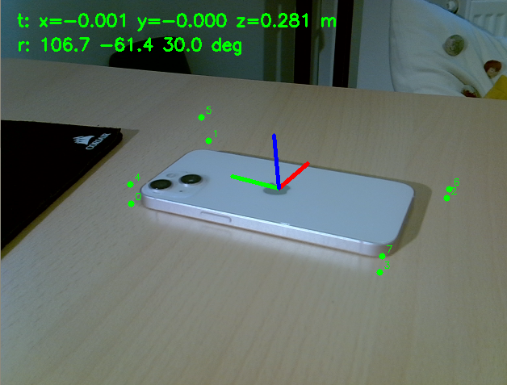

# 3D Object Pose Estimation with YOLO + PnP



Estimate the 6-DoF pose (position + orientation) of an iPhone 13 from a single RGB camera frame — no markers, no depth sensor.

The approach: train YOLOv8-pose to detect 8 corner keypoints on the phone body, then use OpenCV `solvePnP` to recover the 3D pose from those 2D–3D correspondences. This is the same math that ArUco uses, applied to a real object instead of a printed marker.

---

## Pipeline

```
CAD model (STL)
      │
      ▼
Blender renders                  ← scripts/generate_dataset.py
  (synthetic images + auto labels)
      │
      ▼
Train YOLOv8-pose                ← scripts/train.py
      │
      ▼
Real-time inference              ← scripts/run_pose_estimation.py
  YOLO detects 8 keypoints (2D)
  solvePnP recovers rvec + tvec
```

---

## Project Structure

```
cad/
  iphone13.stl                    iPhone 13 (standard, 2 cameras) CAD model in mm
config/
  camera_calibration.yaml         fx=676.68, fy=677.34, cx=345.79, cy=236.51
dataset/
  images/train/                   997 synthetic renders (PNG)
  images/val/                     188 synthetic renders (PNG)
  labels/train/                   YOLO pose annotations (.txt)
  labels/val/                     YOLO pose annotations (.txt)
  dataset.yaml
runs/
  run_100/weights/best.pt         Trained model (6.5 MB)
scripts/
  inspect_stl_dimensions.py       Print STL bounding box dimensions (Blender)
  generate_dataset.py             Generate the full synthetic training dataset (Blender)
  split_train_val.py              Move 10% of train images → val
  train.py                        Train YOLOv8n-pose for 100 epochs
  run_pose_estimation.py          Real-time pose estimation from webcam
tests/
  render_single_image.py          Render one test image to check the pipeline (Blender)
  verify_pose_on_synthetic.py     Verify YOLO + solvePnP on a known Blender render
```

---

## Step-by-Step Guide

### 1. Get the CAD model

Download the iPhone 13 STL from Printables (search "iphone13 stl printables sumit_basra").
Place it at `cad/iphone13.stl`. The model should be the **standard iPhone 13** (2 cameras, not Pro/Max).
Units are in mm, centered at origin, screen face pointing in −Z.

Run `inspect_stl_dimensions.py` to verify dimensions:

```bash
blender --background --python scripts/inspect_stl_dimensions.py
```

Expected output: X ≈ ±36.2 mm, Y ≈ ±73.4 mm, Z ≈ −3.8 to +6.3 mm.

### 2. Camera calibration

Copy your calibration file to `config/camera_calibration.yaml`.
It needs `camera_matrix` and `distortion_coefficients` in OpenCV YAML format.

The calibration is used both by Blender (to match the render FOV to the real camera) and by `solvePnP` at inference time.

### 3. Generate synthetic training data

```bash
blender --background --python scripts/generate_dataset.py
```

This script places the phone at the origin, moves a virtual camera to random positions on a hemisphere (distance 150–1000 mm, elevation 5–85°), and renders each frame with Cycles + OptiX. For each render it:
1. Projects the 8 bounding box corners to pixel coordinates using `world_to_camera_view`
2. Marks each keypoint as visible (facing camera) or occluded (back face) using face normal dot product
3. Writes a YOLO pose label file alongside the image

Key settings in the script:
| Parameter | Value | Meaning |
|-----------|-------|---------|
| `NUM_RENDERS` | 1000 | Images to generate |
| `RENDER_SAMPLES` | 64 | Cycles render samples (quality) |
| `MIN/MAX_DISTANCE_MM` | 150–1000 mm | Camera distance range |
| `MIN/MAX_ELEVATION_DEG` | 5–85° | Camera elevation range |

Takes about 15 minutes with RTX 4060 + OptiX.

### 4. Split train / val

```bash
python3 scripts/split_train_val.py
```

Moves a random 10% of images and labels from `train/` to `val/`.
Result: ~900 train, ~100 val (exact numbers depend on how many renders succeeded).

### 5. Train YOLO

```bash
python3 scripts/train.py
```

Uses YOLOv8n-pose (nano, ~3M parameters) with 100 epochs, batch 16, image size 640.

**Training results (run_100, RTX 4060, 8.7 minutes):**

| Epoch | pose_loss | Pose mAP50 |
|-------|-----------|------------|
| 1     | 9.50      | 0.001      |
| 25    | 2.1       | 0.85       |
| 50    | 0.80      | 0.97       |
| 100   | 0.31      | 0.994      |

Model saved to `runs/run_100/weights/best.pt`.

### 6. Verify on a synthetic image

```bash
# Render one image from a known camera position
blender --background --python tests/verify_pose_on_synthetic.py -- --mode render

# Run YOLO + solvePnP and compare against ground truth
python3 tests/verify_pose_on_synthetic.py --mode predict
```

This is a sanity check. The script renders the phone from a fixed position (80, −250, 120) mm, then runs the full inference pipeline and prints predicted tvec vs known camera position. It also prints per-step inference times (YOLO ms, PnP ms).

### 7. Run real-time pose estimation

```bash
python3 scripts/run_pose_estimation.py
```

Opens webcam index 2 (change `CAMERA_INDEX` at the top of the file if needed).
Detections below 75% confidence are skipped.
Displays axes drawn on the phone and prints pose + timing to the terminal at 1 Hz.

---

## Inference Timing

Measured on RTX 4060 (640×480 input):

| Step | Time |
|------|------|
| YOLO keypoint detection | ~8–12 ms |
| solvePnP | < 1 ms |
| **Total per frame** | **~10–13 ms (~80–100 FPS)** |

The bottleneck is YOLO. `solvePnP` is essentially free — it's just solving a small linear system with 8 point correspondences.

---

## Keypoint Definition

8 corners of the phone bounding box, consistent across Blender rendering and solvePnP:

```
kp0  screen top-left      (-HALF_WIDTH,  HALF_HEIGHT, -HALF_DEPTH)
kp1  screen top-right     ( HALF_WIDTH,  HALF_HEIGHT, -HALF_DEPTH)
kp2  screen bottom-right  ( HALF_WIDTH, -HALF_HEIGHT, -HALF_DEPTH)
kp3  screen bottom-left   (-HALF_WIDTH, -HALF_HEIGHT, -HALF_DEPTH)
kp4  back top-left        (-HALF_WIDTH,  HALF_HEIGHT,  HALF_DEPTH)
kp5  back top-right       ( HALF_WIDTH,  HALF_HEIGHT,  HALF_DEPTH)
kp6  back bottom-right    ( HALF_WIDTH, -HALF_HEIGHT,  HALF_DEPTH)
kp7  back bottom-left     (-HALF_WIDTH, -HALF_HEIGHT,  HALF_DEPTH)

HALF_WIDTH = 35.75 mm,  HALF_HEIGHT = 73.35 mm,  HALF_DEPTH = 3.825 mm
```

The order here must match exactly between the Blender render script, the YOLO annotation, and the `phone_corners_3d` array in `run_pose_estimation.py`.

---

## Known Limitations

1. **Jitter** — the detected keypoints fluctuate frame to frame, so the pose output is noisy. Temporal smoothing (averaging rvec/tvec over the last N frames) would help.

2. **Domain gap** — the model was trained entirely on synthetic Blender renders, which look different from real photos (lighting, texture, background). Performance on real cameras is noticeably worse than on synthetic test images. Fine-tuning with a small set of real photos would close this gap.

3. **No upside-down detection** — the training camera always looks at the phone from above (elevation 5–85°). The model has never seen the phone upside-down or from below.

4. **False detections** — the model occasionally detects the phone where there is none. The 0.75 confidence threshold helps filter these out.

---

## Dependencies

```
Python      3.10+
ultralytics 8.x      (pip install ultralytics)
opencv-python        (pip install opencv-python)
numpy
Blender     5.1+     (for data generation only)
```
